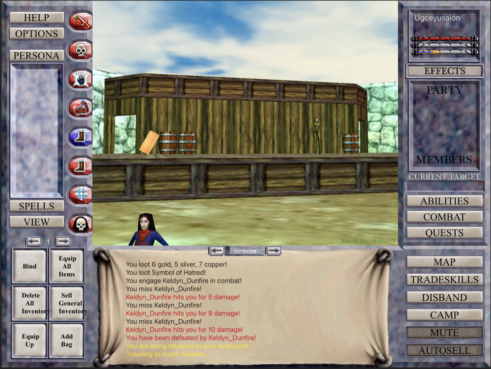
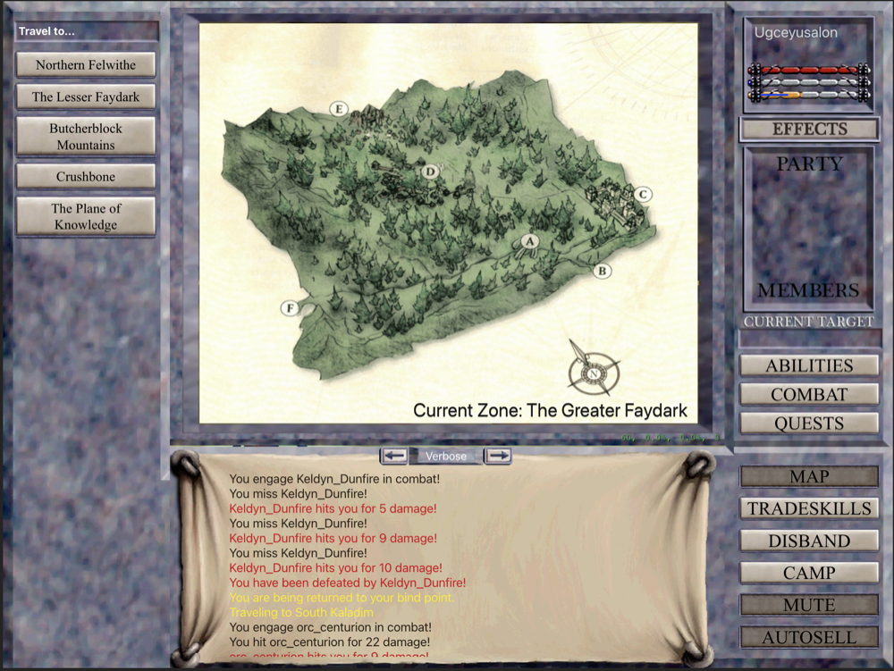

Demo coming soon!

IdleQuest is an online [idle/incremental game](https://en.wikipedia.org/wiki/Incremental_game) based on EverQuest, the iconic MMO released in 1999. Designed to mostly progress on its own, players get to interact with the classic EverQuest interface (and fellow players!) to relive some nostaliga and have fun managing their character as it advances. The goal is to recreate as much of the original EverQuest experience as possible using a database dump from the EverQuest emulator (EQEmu) project, which itself is data from scraping the original game. This data, rooted in the original game, allows for a nostalgic and detailed experience of EverQuest's world without the brutal time-sink of the original game.

Current features:

* Real-time Go server with real-time combat
* Zoning between all Titanium-era zones (185+)
* 5000+ NPCs to talk to via LLM integration or engage in combat with
* 26,000+ items, 20,000+ unique spawns, with true-to-original drop rates and stats
* Leveling to 60 across all races and classes

Work in progress features:

* Tradeskills
* Quest tracking and turn-ins with rewards
* More robust AI-based dialogue and questing system
* More true-to-original combat dynamics
* Multiplayer chat and grouping with other characters

The game content and mechanics are as true to the original experience as can be reasonably done with a single developer - the interface, classes, races, zones, items, NPCs, loot drops, skills, spells, etc are all very close to original EverQuest content. IdleQuest is aso online and multiplayer, aiming for server-wide chatting, grouping with other characters, and plans to support all the same multiplayer features of the original.

Though there may be implementation of 3D graphics in the future, the current focus on this project is text-based adventuring with some visual aids. EverQuest was originally created from the era of MUDs (multi-user dungeons) which were basically EverQuest without graphics. It's fun to now return to the MUD heritage of the game, but with the addition of LLMs for dynamic quests, dialogue, and storytelling.

I would like to give credit to Eric Fredricksen, the creator of [ProgressQuest](https://en.wikipedia.org/wiki/Progress_Quest) from 2002, which is also interestingly the example project used for the "idle games" article on Wikipedia. Though ProgressQuest is much simpler in nature and doesn't contain content from the real game, I want to recognize that this isn't a wholly original idea on my behalf, and I have fond memories of playing ProgressQuest 20+ years ago. Lots of credit also goes to the EQEmu project, whose data collection and server project is heavily relied upon, and the EQ:Requiem project, who converted large parts of the EQEmu project to Go.

## Screenshots

